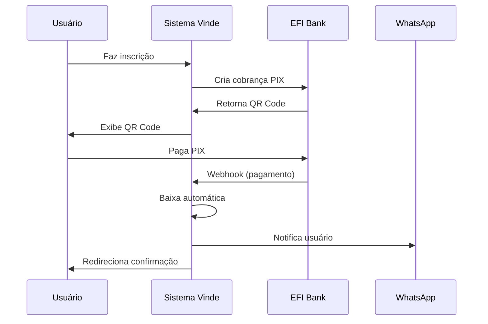

# 🏦 Integração EFI Bank PIX - Sistema Vinde

## 📋 Visão Geral

Esta integração permite que o sistema Vinde processe pagamentos PIX automaticamente através da **EFI Bank** (antigo Gerencianet), com **baixa automática** de pagamentos.

### ✨ Funcionalidades

- ✅ **Criação automática de cobranças PIX** via API EFI
- ✅ **QR Code dinâmico** gerado pela EFI Bank
- ✅ **Webhook para baixa automática** de pagamentos
- ✅ **Notificações WhatsApp** automáticas
- ✅ **Logs detalhados** de todas as operações
- ✅ **Fallback para PIX manual** caso EFI esteja inativo
- ✅ **Ambiente de homologação e produção**

---

## 🚀 Configuração Inicial

### 1️⃣ **Criar Conta na EFI Bank**

1. Acesse [EFI Bank](https://sejaefi.com.br)
2. Crie sua conta digital
3. Ative a API PIX

### 2️⃣ **Obter Credenciais**

1. Acesse sua conta EFI Bank
2. Vá em **API** > **Aplicações**
3. Crie uma nova aplicação ou edite uma existente
4. Ative a **API PIX** com os escopos:
   - `cob.write` - Alterar cobranças
   - `cob.read` - Consultar cobranças  
   - `pix.write` - Alterar PIX
   - `pix.read` - Consultar PIX
   - `webhook.write` - Alterar Webhooks
   - `webhook.read` - Consultar Webhooks

5. Anote as credenciais:
   - **Client ID Homologação**
   - **Client Secret Homologação**
   - **Client ID Produção**
   - **Client Secret Produção**

### 3️⃣ **Baixar Certificados**

1. Na mesma página da aplicação, gere e baixe os certificados `.p12`
2. Baixe um para **Homologação** e outro para **Produção**
3. Anote a senha do certificado (se houver)

---

## ⚙️ Configuração no Sistema

### 1️⃣ **Editar Credenciais**

Edite o arquivo `includes/config.php` e configure:

```php
// Credenciais EFI Bank
define('EFI_CLIENT_ID_PROD', 'seu_client_id_producao');
define('EFI_CLIENT_SECRET_PROD', 'seu_client_secret_producao');
define('EFI_CLIENT_ID_HOM', 'seu_client_id_homologacao');
define('EFI_CLIENT_SECRET_HOM', 'seu_client_secret_homologacao');
define('EFI_SENHA_CERTIFICADO', 'senha_do_certificado'); // Se houver
```

### 2️⃣ **Instalar Certificados**

1. Coloque os certificados `.p12` no diretório `certificados/`:
   ```
   certificados/
   ├── certificado_hom.p12    # Homologação
   └── certificado_prod.p12   # Produção
   ```

### 3️⃣ **Executar Script SQL**

Execute o script `database_efi_update.sql` para adicionar as tabelas e campos necessários:

```bash
mysql -u root -p eventos_catolicos < database_efi_update.sql
```

### 4️⃣ **Configurar via Admin**

1. Acesse: `http://localhost/vinde/admin/efi_config.php`
2. Configure:
   - ✅ **Ativar EFI Bank**
   - 🌍 **Ambiente** (desenvolvimento/produção)
   - 🔗 **URL do Webhook**
3. **Teste a conexão**
4. **Configure o webhook automaticamente**

---

## 🔗 Configuração do Webhook

### Automática (Recomendada)

1. Acesse o admin: `/admin/efi_config.php`
2. Clique em **"Configurar Webhook Automaticamente"**

### Manual

1. Acesse sua conta EFI Bank
2. Vá em **API** > **Webhook**
3. Configure a URL: `https://seudominio.com/vinde/webhook_efi.php`
4. Selecione eventos: **PIX recebidos**

---

## 🧪 Testes

### 1️⃣ **Teste de Conexão**

No admin (`/admin/efi_config.php`), clique em **"Testar Conexão"** para verificar:

- ✅ Certificado encontrado
- ✅ Credenciais válidas  
- ✅ Autenticação funcionando
- ✅ API respondendo

### 2️⃣ **Teste de Inscrição**

1. Crie um evento de teste
2. Faça uma inscrição
3. Verifique se o QR Code EFI foi gerado
4. Use o PIX Simulado da EFI para testar

### 3️⃣ **Teste do Webhook**

Monitore os logs em `/admin/efi_config.php` para verificar se os webhooks estão sendo recebidos.

---

## 📊 Monitoramento

### Logs Disponíveis

- **`logs_atividades`** - Logs gerais do sistema
- **`efi_logs`** - Logs específicos da EFI Bank

### Visualização

- **Admin Panel**: `/admin/efi_config.php` - Últimos logs EFI
- **Logs Completos**: `/admin/logs.php` - Todos os logs do sistema

---

## 🔄 Fluxo de Pagamento



---

## 🚨 Troubleshooting

### Problemas Comuns

#### 1. **Certificado não encontrado**
```
Solução: Verificar se o arquivo .p12 está no diretório certificados/
```

#### 2. **Erro de autenticação**
```
Solução: Verificar Client ID e Client Secret no config.php
```

#### 3. **Webhook não funciona**
```
Solução: 
- Verificar se URL está acessível externamente
- Conferir logs em /admin/efi_config.php
- Reconfigurar webhook na EFI Bank
```

#### 4. **PIX não baixa automaticamente**
```
Solução:
- Verificar se webhook está configurado
- Conferir logs do webhook
- Verificar se TXID está correto
```

### Logs de Erro

Verifique os logs em:
- **PHP Error Log**: `logs/php_errors.log`
- **EFI Logs**: Admin > Configuração EFI Bank
- **Sistema Logs**: Admin > Logs de Atividade

---

## 🔐 Segurança

### Boas Práticas

1. **Certificados**: Mantenha os `.p12` fora do webroot
2. **Credenciais**: Não commite credenciais no Git
3. **HTTPS**: Use sempre HTTPS em produção
4. **Webhook**: Valide origem das requisições
5. **Logs**: Monitore logs suspeitos

### Configurações de Segurança

- ✅ Validação de CSRF tokens
- ✅ Escape de dados de saída  
- ✅ Prepared statements
- ✅ Logs de auditoria
- ✅ Rate limiting (webhook)

---

## 📞 Suporte

### Documentação EFI Bank

- 📖 [Documentação Oficial](https://dev.efipay.com.br/docs/api-pix/credenciais)
- 🎯 [Guia de Integração](https://dev.efipay.com.br/docs/api-pix)
- 💬 [Suporte EFI Bank](https://gerencianet.freshdesk.com)

### Sistema Vinde

- 📧 Email: suporte@vinde.com.br
- 📱 WhatsApp: (11) 99999-9999
- 🐛 Issues: GitHub do projeto

---

## 🚀 Produção

### Checklist de Deploy

- [ ] Credenciais de produção configuradas
- [ ] Certificado de produção instalado
- [ ] Ambiente alterado para "producao"
- [ ] Webhook configurado com URL de produção
- [ ] Testes realizados em ambiente de produção
- [ ] Monitoramento ativo
- [ ] Backup do banco de dados

### Monitoramento Contínuo

- 📊 Dashboard de pagamentos
- 📈 Relatórios financeiros
- 🔔 Alertas por email/WhatsApp
- 📝 Logs automáticos

---

**🎉 Pronto! Sua integração EFI Bank está configurada e funcionando com baixa automática de pagamentos PIX!** 